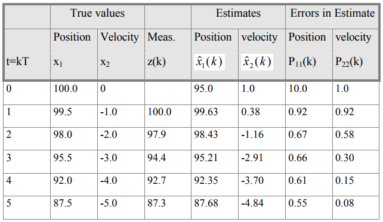

# DEMO

This is a simple demo to illustrate how the *LinearAlgebra* library works. The two main features of this demo is the **lti_system** class and the **kalman** class. In this demo we will implement a Kalman filter to track the position of a free falling ball given that we measure its position with a noisy instrument. This demo is based upon [Kalman](http://biorobotics.ri.cmu.edu/papers/sbp_papers/integrated3/kleeman_kalman_basics.pdf). All functions of this demo are self-explanatory, so feel free to read the respective header and source files to understand what's under the hood.

## PREREQUISITES

Enable C++11 as explained in the main README file. The CXXFLAGS variable, specified in the current makefile, does the job in this demo case. This is what it looks like:
```
CXXFLAGS = -std=c++0x -D__cplusplus=201103L -O3 -Wall -fmessage-length=0
```
 
The first two settings are responsible for enabling C++11 together with the proper compiler choice (g++-4.8 in this case).

## RUN THE DEMO

**_Step 1_:**

Download and store the *LinearAlgebra* library  under any directory you prefer as desribed in the main README file.

**_Step 2_:**

Navigate to the demo folder and type the following on your terminal

```
cd /your_path/LinearAlgebra/demo
make clean
make all
```

You should see the following:

```
********* RUN DEMO *************
********************************
 
pos_true = [ 100 99.5 98 95.5 92 87.5 ]
pos_meas = [ nan 100 97.9 94.4 92.7 87.3 ]
pos_hat  = [ 95 99.625 98.4333 95.2143 92.355 87.6848 ]

vel_true = [ 0 -1 -2 -3 -4 -5 ]
vel_hat  = [ 1 0.375 -1.15833 -2.90476 -3.69447 -4.84356 ]

est_err_pos = [ 10 0.916667 0.666667 0.657143 0.612546 0.552805 ]
est_err_vel = [ 1 0.916667 0.583333 0.295238 0.151292 0.0841584 ]

```
These results can be cross-checked by looking on the table at page 24 of the [Kalman](http://biorobotics.ri.cmu.edu/papers/sbp_papers/integrated3/kleeman_kalman_basics.pdf). For the impatient reader, this is the aforementioned table:



In case you want to manually run the binary yourself type this on your terminal:
```
build/bin/./KalmanFilter
```

## CROSS-COMPILE DEMO

Install the ARM cross compiler toolchain on your Linux Ubuntu PC:
```
$ sudo apt-get install libc6-armel-cross libc6-dev-armel-cross
$ sudo apt-get install binutils-arm-linux-gnueabi
$ sudo apt-get install libncurses5-dev
```
If you are using an Arietta, Aria or FOX G20 board:
```
$ sudo apt-get install gcc-arm-linux-gnueabi
$ sudo apt-get install g++-arm-linux-gnueabi
```
If you are using an Acqua or RoadRunner board:
```
$ sudo apt-get install gcc-arm-linux-gnueabihf
$ sudo apt-get install g++-arm-linux-gnueabihf
```

Now, you can simply edit the makefile and modify line 11 accordingly.


## AUTHORS

* **Ioannis Karagiannis** 

## LICENSE

This project is licensed under the GNU General Public License - see the [LICENSE.md](https://github.com/IoannisKaragiannis/LinearAlgebra/blob/master/LICENSE) file for details
